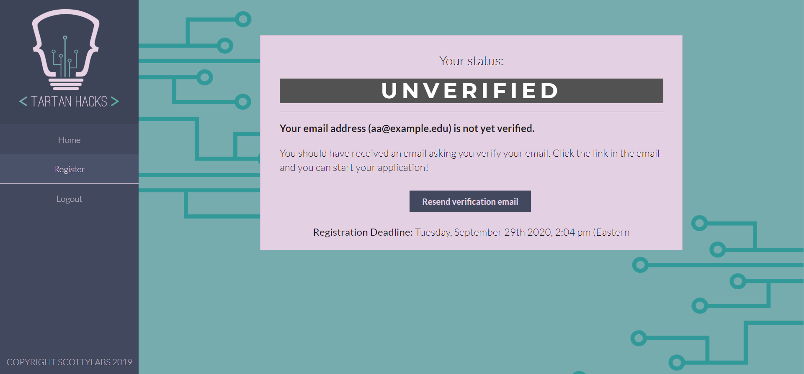
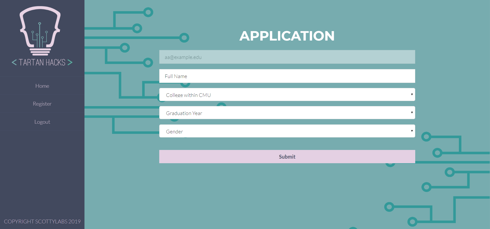
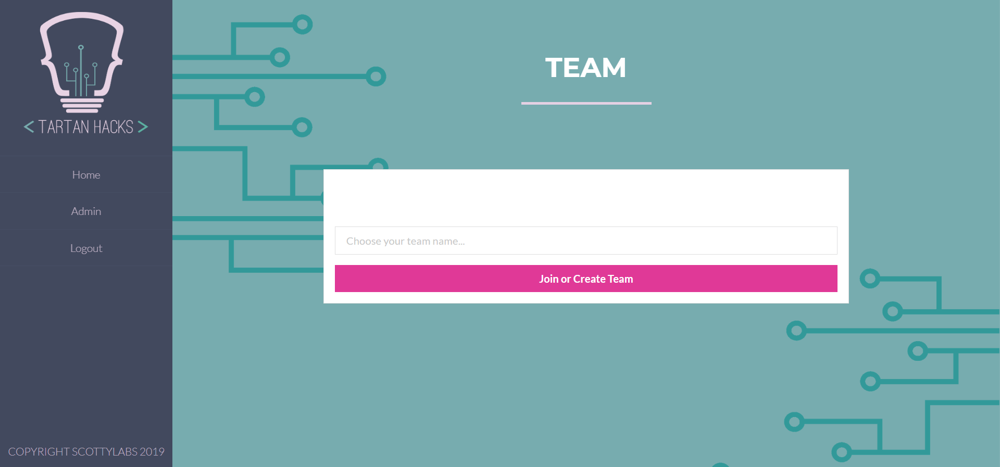
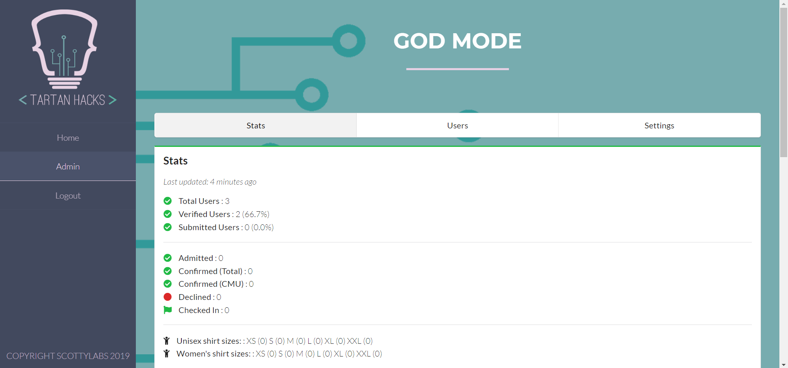
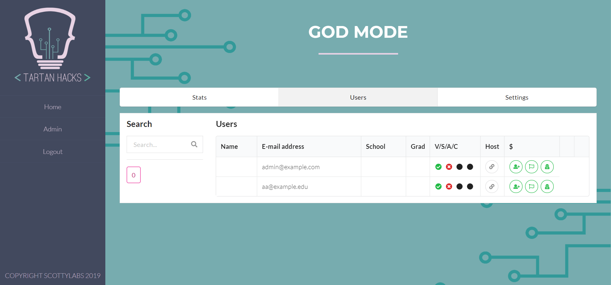

# TartanHacksRegistration
Official registration system for TartanHacks 2019 at Carnegie Mellon University.

Forked from MIT Quill

# Setup

### Requirements
| Requirement                                 | Version |
| ------------------------------------------- | ------- |
| [Node.js](http://nodejs.org)                | `10.13+`  |
| [MongoDB](www.mongodb.com/) | `4.0+`  |

Run the following commands to check the current installed versions:

```bash
$ node -v
$ mongo --version
```
If you receive an error, it likely means that you do not have these installed!

How to install/upgrade to latest releases:
- Node.js: https://nodejs.org/en/download/
- MongoDB: https://docs.mongodb.com/manual/administration/install-community/

For inexperienced SQL users, MongoDB Compass is highly recommended. In the installation for MongoDB, is installed as an additional feature and needs to be checked.

### Deploying locally
Start by setting up the database. Make sure that you are in the root directory of your repository. 

```bash
$ mkdir db
$ mongod --dbpath db --bind_ip 127.0.0.1
```

mongod should run in the background the entire time, so open a new window and continue with the set up.

Install the necessary dependencies:
```bash
$ npm install
```

If you haven't already, clone the TartanHacksRegistration repository and make sure you know where it is stored on your computer. Navigate to the folder in your command prompt using cd <pathname>.

We use `dotenv` to keep track of environment variables, so be sure to stop tracking the `.env` file in Git:
```bash
$ git update-index --assume-unchanged .env
```

Make sure you are calling the previous command from within the repository folder. 

If you don't already have gulp installed, follow instructions here: https://www.npmjs.com/package/gulp-install

Before calling gulp, check your node version:
```bash
$ node --version
```

and gulp version:
```bash
$ gulp --version
```

If your node version is 12+ and gulp is 3+, there will be compatibility issues so downgrade your node version using:
```bash
$ npm install -g n
$ n 10.16.0
```

Edit the configuration file in `.env` for your setup, and then run the application:
```bash
$ gulp server
```

Once the server is running, you can use the app by going to [localhost:3000](http://localhost:3000)

### Troubleshooting

If mongod has an "Address already in use" error, there is already a version of mongod running in the background, so find the process ID for that command and then use that number to kill the previous process:
```bash
$ lsof -PiTCP -sTCP:LISTEN
```
Find mongod under command and remember the value under PID for it. Then, run the following command, replacing <mongod process ID> with that value.

$ kill <mongod process ID>
```

If you are using a mac, make sure to add sudo in front of the commands to get around permission.s.

Install dotenv if running "gulp server" gives a missing dotenv error:
```bash
$ npm install --dotenv-extended
```

# Usage
## Quill for Users
### Dashboard


After users login, the Dashboard displays the user’s application status and status-specific prompts to resend a verification email, view/edit their application or confirmation forms.

Statuses:
- Unverified: users have not verified the email address they registered with
- Incomplete, registration open: the user has not submitted their application, but the registration deadline has not passed
- Incomplete, registration closed: the user has not submitted, but the registration deadline has passed
- Submitted, registration open
- Submitted, registration closed
- Admitted / unconfirmed: the user has been admitted to the event, but has not confirmed their attendance and submitted their confirmation form
- Admitted / confirmation deadline passed: the user has been admitted, but did not confirm their attendance before the deadline
- Waitlisted: the user was not admitted to the event
- Confirmed: the user has been admitted and has confirmed their attendance
- User declined admission: the user has been admitted, but will not be attending the event

### Application


The Application tab takes users to their registration or confirmation form.

### Team Registration
Hackathons commonly allow participants to register and be admitted as a team. Once the user has completed the application, they will be allowed to create/join a team.



## Quill for Admins
Admins can view stats, look through applications, or edit settings from the Admin panel.

### Stats


The Stats tab summarizes useful registration statistics on the number of users in each stage of the process, demographic information, and miscellaneous event preferences like shirt sizes, dietary restrictions, or reimbursement requests.

### Users Table


The Users tab displays a table of users where admins can:
1. Search for a user by name
2. Quick-view user applications in a pop-up modal
3. See a user’s application status (verified, submitted, admitted, and confirmed) at-a-glance
4. See responses to other miscellaneous fields on the application
5. Open and edit an individual application
6. Admit users manually
7.  Mark users as checked-in at the event day-of

### Settings


On the Settings tab, admins can easily control their event application timeline by setting registration / confirmation deadlines. They can also write custom waitlist, acceptance, and confirmation copy that users will see on their dashboard throughout the application process. The custom copy is interpreted as Markdown, so HTML and images can be added.
